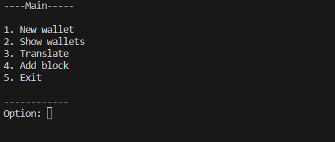

# Blockchain Classes UdeA 202302

## Instruction

Execute the blockchain.py file, the following menu will be displayed in the console, the .json files are initialized in the repository where the wallets, transactions and blocks will be supported

1. You can create wallets by entering a string that will be taken as the address.
2. Show the list of created wallets
3. Queue Transaction between 2 wallets
4. Create the block and deposit the transaccions in the detination wallets
5. Close app.